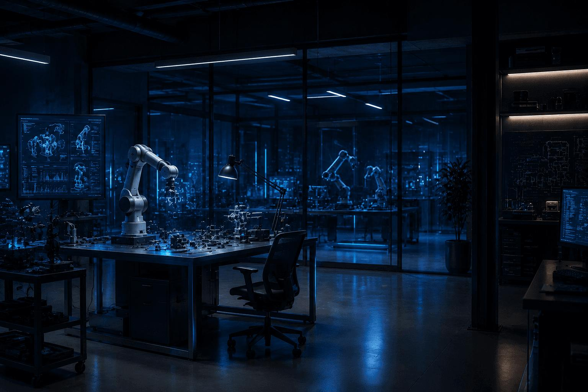

# Deepak Jowel

### Robotics & Autonomous Systems

Specialising in robot learning, perception, navigation and intelligent manipulation.
Interested in physical intelligence, data-efficient robot learning, physics-informed robotics and human augmentation.

# 💻 Tech Stack:
                   

---

## Research Interests
|                              |                            |                                |                             |
|------------------------------|----------------------------|--------------------------------|-----------------------------|
| 🤖 Robot Perception          | 🧠 Reinforcement Learning | 🗺️ SLAM & Autonomous Navigation | ⚛️ Physics-Informed Systems |
| 🦾 Bio-Inspired Augmentation | 🎯 Trajectory Optimization | 🧍 Human-Robot Interaction |  🌐 Embodied AI                 |

---

## Featured Projects

| Project                      | What it demonstrates              |
| ---------------------------- | --------------------------------- |
| 🦾 Bio-Inspired Robotic Tail | MuJoCo · RL(PPO) · Dynamics       |
| 🗺️ Autonomous LIMO          | ROS2 · LiDAR · SLAM                |
| 🤖 Robot Learning            | DMP · SEDS · Trajectory Learning  |
| 🐕 Quadruped RL              | MuJoCo · PPO · Locomotion         |
| 👁️ Vision-Language          | CV · Transformers · Multimodal AI |
| 🧍 Human Augmentation        | 3D reconstruction · Prosthetics   |

---

## Technical Stack

### Robotics
`ROS2` `Nav2` `MoveIt` `MuJoCo` `CoppeliaSim`

### Programming
`Python` `C++` `MATLAB` `Embedded C`

### AI / ML
`PyTorch` `TensorFlow` `Stable-Baselines3`

### Perception
`OpenCV` `SLAM` `VIO` `3D Vision`

---

## Currently Exploring

- Data-efficient reinforcement learning
- Physics-informed robot learning
- Vision-Language-Action models
- Learning-based manipulation
- Sim-to-real transfer
- Human augmentation

---

## Research Direction

**Perception → Learning → Planning → Control → Physical Interaction**

---

## 🌐 Socials:
 

# 📊 GitHub Stats:
 
 

🌐 Portfolio: deepakjowel95.github.io
💻 GitHub: github.com/deepakjowel95
